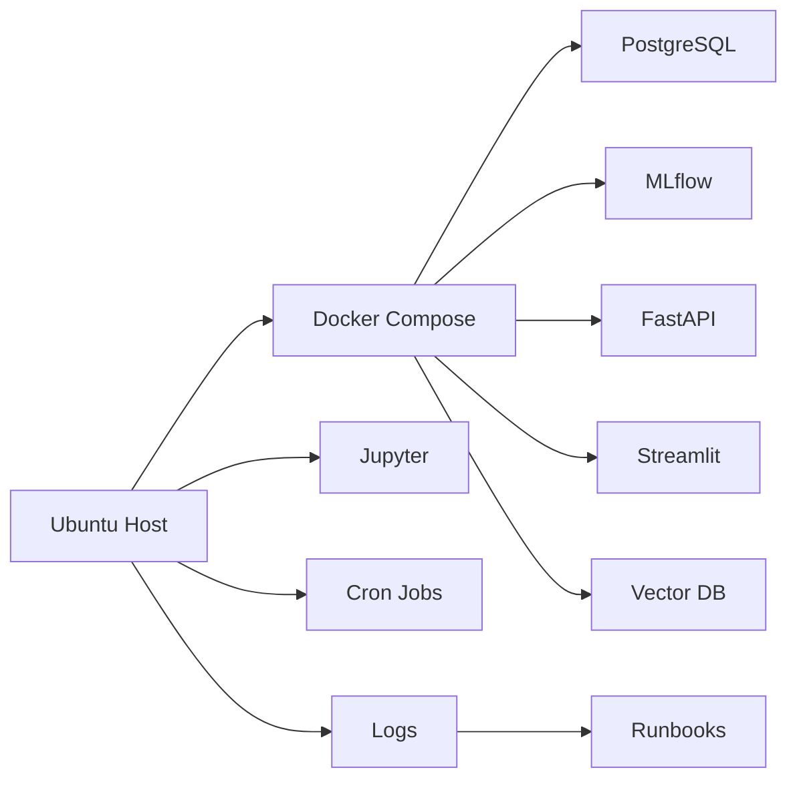

# Data / MLOps Runtime Stack

This document explains how the personal infrastructure lab can support future DataOps, Data Engineering and MLOps projects.

It is intentionally practical: the goal is to show how the Ubuntu host can become a controlled runtime for portfolio-grade workloads without turning the lab into a public production system.

---

## Runtime principle

| Layer | Runs on | Reason |
|---|---|---|
| Linux administration | Ubuntu host | Production-like environment for services, cron, Docker and logs |
| Docker services | Ubuntu host | Avoid nested-virtualization issues and keep workloads isolated |
| Jupyter / Python | Ubuntu host | Data-science environment close to Linux runtime |
| PostgreSQL / local DB labs | Ubuntu host via Docker | Reproducible DataOps and SQL exercises |
| Windows-only tools | Windows VM | Isolation of vendor/desktop tools from host services |
| Private access | Tailscale / SSH tunnel | No public administrative exposure |

---

## Future workloads supported

| Future repo | Local runtime need | Infra lab support |
|---|---|---|
| `banking-dataops-monitoring` | PostgreSQL, Python scripts, Streamlit dashboard, logs | Docker Compose, Linux cron, service checks |
| `fraud-mlops-control-tower` | MLflow, FastAPI, model training scripts, Dockerized API | Host-level Docker, Python runtime, service monitoring |
| `database-migration-quality-lab` | Two databases, migration scripts, validation reports | Docker Compose with isolated DB containers |
| `secure-wealth-rag-assistant` | Vector DB, RAG API, evaluation scripts | Docker services, private runtime, sanitized synthetic docs |
| `jedha-rncp35288-portfolio` | Notebooks, scripts, evidence generation | Jupyter on Ubuntu host and reproducible environments |

---

## Recommended local service stack



---

## Python environment baseline

| Category | Libraries / tools |
|---|---|
| Core environment | `python`, `uv` or `poetry`, `pip`, `venv` |
| Quality | `ruff`, `black`, `mypy`, `pre-commit` |
| Testing | `pytest`, `pytest-cov`, `hypothesis` |
| Data | `pandas`, `polars`, `numpy`, `duckdb`, `pyarrow` |
| SQL | `sqlalchemy`, `psycopg`, `asyncpg` |
| Dashboard | `streamlit`, `plotly` |
| ML | `scikit-learn`, `xgboost`, `lightgbm`, `imbalanced-learn`, `optuna` |
| MLOps | `mlflow`, `fastapi`, `pydantic`, `evidently` |
| LLMOps | `transformers`, `sentence-transformers`, `langchain`, `llamaindex`, `chromadb`, `faiss` |
| Observability | `structlog`, `opentelemetry`, Prometheus/Grafana integration notes |
| Security | `pip-audit`, `bandit`, `detect-secrets` |

---

## Service checklist before adding a new workload

Before adding any new service to the host, answer:

1. What port does it use?
2. Is the port private, tunneled or public?
3. Does the service need persistent storage?
4. Where are logs written?
5. How is the service stopped and restarted?
6. How is it backed up?
7. What secrets does it need?
8. Is the documentation sanitized before publication?

---

## Minimal DataOps lab profile

A good first workload for this infrastructure is:

```text
PostgreSQL container
+ Python ingestion script
+ SQL data quality checks
+ Streamlit dashboard
+ cron or manual run script
+ logs
+ incident runbook
```

This maps directly to future banking-data portfolio needs.

---

## Minimal MLOps lab profile

A good second workload is:

```text
MLflow tracking server
+ training script
+ model artifact
+ FastAPI serving API
+ Dockerfile
+ tests
+ model card
+ monitoring plan
```

This maps directly to future fraud/risk ML portfolio needs.

---

## Public safety rule

Do not publish:

- real service URLs;
- real hostnames;
- real IP addresses;
- `.env` files;
- database dumps;
- private logs;
- screenshots with tokens or machine identifiers.

Use architecture and operational documentation as public evidence, not live system exposure.
